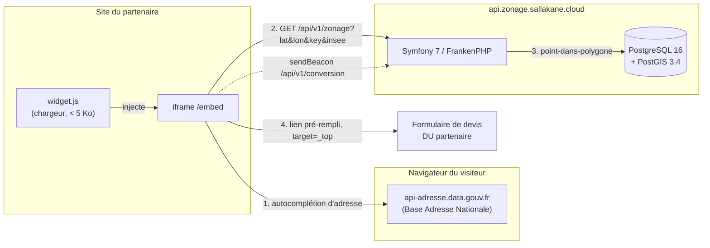
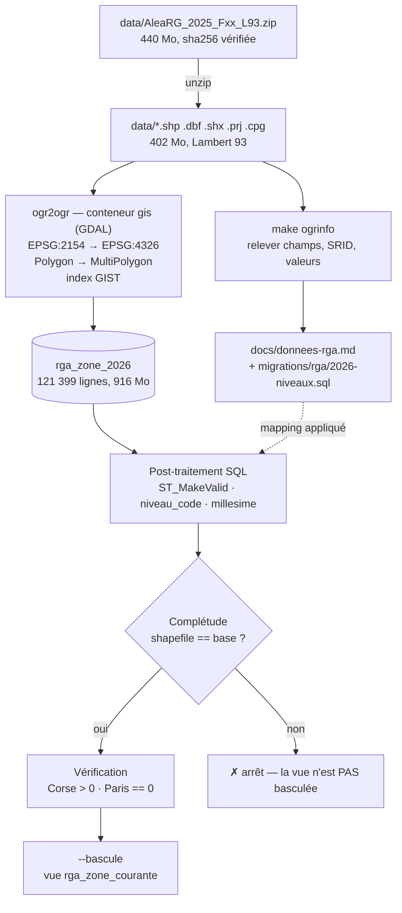
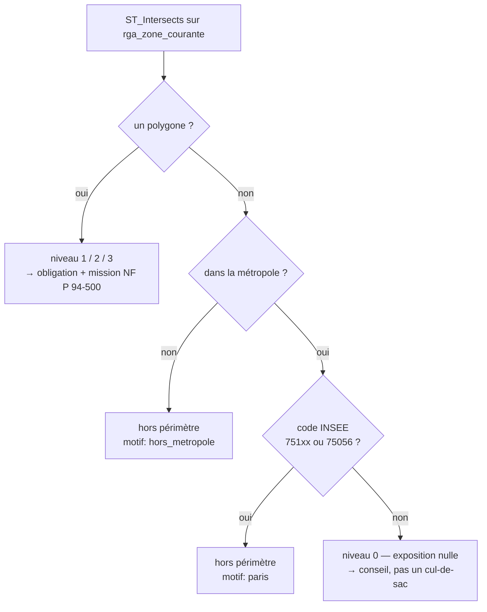
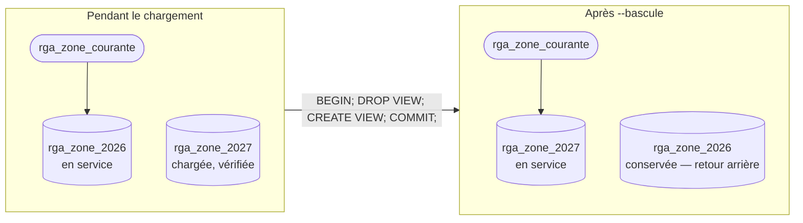
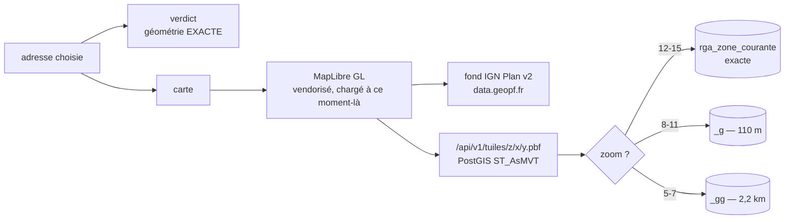
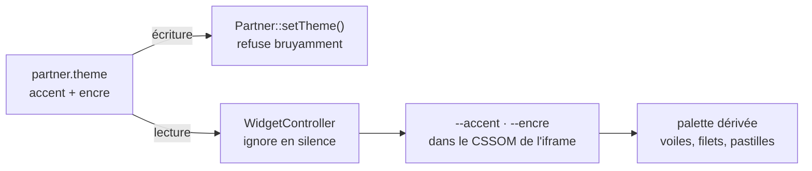

# Simulateur RGA

Simulateur d'exposition au **retrait-gonflement des argiles**, embarquable sur
le site d'un bureau d'études par une balise `<script>`. Le visiteur saisit
l'adresse de son terrain, obtient le niveau d'exposition officiel, l'obligation
réglementaire qui en découle, et un lien vers un formulaire de devis pré-rempli
avec ce contexte.

- **Spécification** : [`SPEC.md`](SPEC.md) — la référence, ce README en est la vue d'ensemble.
- **La donnée** : [`docs/donnees-rga.md`](docs/donnees-rga.md) — millésime, lien de téléchargement, relevé du shapefile.
- **L'exploitation** : [`docs/exploitation.md`](docs/exploitation.md) — déploiement, sauvegarde, incidents.

---

## 1. Vue d'ensemble



Trois décisions structurent tout le reste :

| Décision | Pourquoi |
|---|---|
| **La carte est hébergée chez nous**, pas interrogée chez Géorisques | L'API Géorisques répond en ~10 s. Ici c'est quelques millisecondes, sans dépendance externe, et on garantit quel millésime répond (SPEC §3). |
| **Le géocodage reste externe et côté navigateur** | La BAN est gratuite, sans clé, et l'adresse ne passe jamais par nos journaux. |
| **Le lead ne transite pas par ce serveur** | Le visiteur remplit le formulaire du partenaire, sur le domaine du partenaire. Aucune donnée personnelle ne nous touche (SPEC §9). |

---

## 2. La carte en local : pourquoi et comment

### 2.1 Ce qu'on télécharge

Géorisques publie le zonage sous forme d'un **shapefile national** : un ZIP de
440 Mo, 402 Mo décompressés, **121 399 polygones** en projection Lambert 93
(EPSG:2154), sous licence Etalab 2.0.

Le lien n'est pas devinable — la page de téléchargement est une interface
JavaScript. Il se demande à l'API de Géorisques :

```bash
# 1. La clé de la base, dans l'attribut data-js-base-key de la page
curl -s https://www.georisques.gouv.fr/donnees/bases-de-donnees/retrait-gonflement-des-argiles-version-2026 \
  | grep -o 'data-js-base-key="[^"]*"'          # -> alearg_25

# 2. Le lien du fichier, échelle nationale
curl -s 'https://www.georisques.gouv.fr/webappReport/ws/telechargements/formats/zip/alearg_25?echelle=nationale'
# -> https://files.georisques.fr/argiles/2025/AleaRG_2025_Fxx_L93.zip
```

Le fichier se dépose dans `data/`, **gitignoré** : plusieurs centaines de Mo
n'ont rien à faire dans un dépôt. Sa somme de contrôle sha256 est dans
[`docs/donnees-rga.md`](docs/donnees-rga.md) — et elle sert : une URL très
proche (`/argiles/AleaRG_Fxx_L93.zip`, sans le `2025/`) répond 200 avec
l'**ancien** millésime de 2021.

### 2.2 Du ZIP à la table PostGIS

Tout le pipeline tient dans un script rejouable : [`bin/charger-rga.sh`](bin/charger-rga.sh).



En pratique, sur un poste ou sur le VPS :

```bash
cd data && unzip AleaRG_2025_Fxx_L93.zip && cd ..

make ogrinfo                                          # NE RIEN SUPPOSER : relever
./bin/charger-rga.sh --millesime 2026 \
    --shp data/AleaRG_2025_Fxx_L93.shp --encoding UTF-8
# ~35 s de chargement, puis quelques minutes de ST_MakeValid

./bin/charger-rga.sh --millesime 2026 --bascule       # mise en service
```

Ajouter `--prod` sur le VPS : la seule différence est le fichier Compose visé.

### 2.3 Les six choix qui font que ça marche

| Étape | Choix | Ce qu'il évite |
|---|---|---|
| Outil | **`ogr2ogr`** (image `ghcr.io/osgeo/gdal`, version **figée**) et non `shp2pgsql` | L'image `postgis/postgis` ne contient pas `shp2pgsql`. Et un `latest` de GDAL est une compilation quotidienne : un pipeline qui change de version tout seul n'est plus rejouable. |
| Projection | **Reprojection L93 → WGS84 au chargement** | Un `ST_Transform` dans la requête chaude rendrait l'index GIST inutilisable — c'est la seule performance qui compte ici. |
| Géométrie | `-nlt MULTIPOLYGON` | Les shapefiles officiels mélangent les deux types. |
| Largeurs | `-lco PRECISION=NO` | Le `.dbf` annonce `surf_m2` en `Real(24.15)` → GDAL en déduit un `NUMERIC(23,15)`, incapable de stocker 1 474 098 685 m². Sans l'option, le chargement s'arrête à 80 %. |
| Validité | `ST_MakeValid` sur les géométries invalides | `ST_Intersects` sur une géométrie invalide peut renvoyer n'importe quoi. |
| Sémantique | `niveau_code` alimenté par [`migrations/rga/2026-niveaux.sql`](migrations/rga/2026-niveaux.sql), versionné | Le code applicatif ne dépend jamais du libellé source. Le fichier lève une exception si une valeur sort du mapping. |

### 2.4 Le contrôle qui n'est pas facultatif

**La carte ne dessine que les zones exposées** : trois valeurs (1 faible,
2 moyen, 3 fort) et **aucun polygone de niveau 0**, pour 395 455 km² couverts
sur ~551 700 km² de métropole.

Conséquence : en France métropolitaine hors Paris, **l'absence de polygone est
une réponse** — « exposition nulle » — pas un trou dans la donnée.

Conséquence de la conséquence : une donnée à moitié chargée répondrait « pas de
risque » sur des régions entières, **en HTTP 200, sans rien signaler**. C'est la
panne la plus coûteuse de ce produit et la plus silencieuse. Le script compare
donc systématiquement le nombre de polygones chargés à celui du shapefile, et
**refuse de basculer la vue** en cas d'écart.

Le millésime lui-même se contrôle : moyen + fort = 301 592 km², soit **54,7 %**
du territoire — l'arrêté du 9 janvier 2026 annonce le passage de 48 % à 55 %.
C'est bien le bon.

---

## 3. Comment la réponse se calcule, concrètement

Le code n'interroge **jamais** une table millésimée. Il interroge une vue,
`rga_zone_courante` :

```sql
SELECT niveau_code, millesime
  FROM rga_zone_courante
 WHERE ST_Intersects(geom, ST_SetSRID(ST_MakePoint(:lon, :lat), 4326))
 ORDER BY niveau_code DESC
 LIMIT 1
```

Trois détails portent tout le comportement ([`src/Service/ZonageResolver.php`](src/Service/ZonageResolver.php)) :

- **SQL natif, pas Doctrine ORM** — Doctrine ne gère pas PostGIS, et c'est la
  seule requête où la performance compte. Elle doit rester une recherche sur
  index GIST.
- **`ORDER BY niveau_code DESC`** — sur une frontière, le point appartient à
  deux polygones. On retient le plus exposé : se tromper vers l'obligation
  d'étude coûte un devis, se tromper dans l'autre sens coûte un vice caché.
- **`LIMIT 1`**, mais l'absence de ligne n'est pas une erreur : elle est
  interprétée.



Le `citycode` de la BAN est transmis par le widget : il rend la détection de
Paris **exacte**, là où une enveloppe rectangulaire déborderait sur la petite
couronne. Sans lui (appel direct à l'API), on retombe sur l'enveloppe.

**Aucune réponse n'est un cul-de-sac** (SPEC §1) — y compris « hors périmètre »,
qui répond en 200 avec son propre message et son propre appel à l'action.

---

## 4. Le millésime : charger d'un côté, servir de l'autre

C'est le rôle de la vue. Elle rend la mise à jour annuelle possible **sans
interruption de service** : le nouveau millésime se charge et se vérifie pendant
que l'ancien continue de répondre, et la bascule est une transaction.



`DROP` + `CREATE` dans **une** transaction, et non `CREATE OR REPLACE` : ce
dernier refuse tout changement de type de colonne, ce qui arrive dès que le
millésime change de schéma. La vue projette les colonnes **explicitement** —
c'est le contrat entre la donnée et le code : le shapefile peut changer de
colonnes, la vue non.

Revenir en arrière, c'est une bascule dans l'autre sens. Règle de rétention :
garder N et N-1, supprimer N-2 (chaque millésime pèse ~1,7 Go, voir
[`docs/exploitation.md`](docs/exploitation.md) §5).

```bash
make ogrinfo                                          # relever le nouveau millésime
$EDITOR docs/donnees-rga.md migrations/rga/<annee>-niveaux.sql
./bin/charger-rga.sh --prod --millesime <annee> --shp … --encoding …
./bin/charger-rga.sh --prod --millesime <annee> --bascule
docker compose -f compose.prod.yaml exec app php bin/console app:zonage:verifier
```

---

## 4bis. La carte

Le verdict dit « zone moyenne ». La carte montre **où passe la limite** — et
c'est ce qui le rend vérifiable : le visiteur reconnaît sa rue, et voit s'il est
au cœur de la zone ou sur son bord.



### La règle qui prime sur toutes les autres

> **La carte dessine. Elle ne décide pas.**

Le niveau annoncé sort de `rga_zone_courante`, géométrie exacte, et de nulle part
ailleurs. La carte, elle, lit des géométries simplifiées dès qu'on s'éloigne : un
trait dessiné n'est jamais une frontière réglementaire, et le widget l'écrit sous
la carte.

**Aux zooms où le visiteur regarde vraiment sa parcelle — 12 et au-delà — la
carte lit la géométrie exacte.** Un test le verrouille.

### Pourquoi trois bandes

Une tuile z6 construite sur la géométrie exacte pèse **5,2 Mo** et coûte
**6,4 s** : 25,8 millions de sommets, dont l'écrasante majorité tient dans moins
d'un pixel. Deux tables dérivées, construites au chargement et basculées dans la
**même transaction** que `rga_zone_courante`, règlent la question.

| Zoom | Vue | Tolérance | Poids | Temps |
|---|---|---|---|---|
| 12–15 | `rga_zone_courante` | exacte | 0,3–3 Ko | 20–60 ms |
| 8–11 | `rga_zone_courante_g` | 110 m (+53 Mo) | 5–85 Ko | 5–65 ms |
| 5–7 | `rga_zone_courante_gg` | 2,2 km (+10 Mo) | 80–400 Ko | 0,1–0,5 s |

Au-delà de z15, le client agrandit la dernière tuile reçue — du vectoriel
agrandi reste net.

Deux pistes ont été mesurées puis **écartées** : dissoudre par niveau
(`ST_Union`) ne fait pas maigrir la tuile, ce sont les sommets qui pèsent, et
découper trois multipolygones géants coûte 14 s au lieu de 0,5 s ; garder 750 m
de tolérance au lieu de 2,2 km coûte 30 % de poids pour un tracé **indiscernable**
à l'échelle nationale.

### Le cache, et le millésime dans l'URL

```
GET /api/v1/tuiles/14/8301/5649.pbf?key=pk_…&m=2026
```

`m` est inscrit dans la page par `/embed`, jamais deviné par le client. C'est ce
qui rend la tuile **immuable** : `max-age=31536000, immutable` quand le millésime
annoncé est celui en service, `no-store` sinon — une page ouverte avant une
bascule ne garde rien.

Côté serveur, `var/tuiles/<millesime>/z/x/y.pbf`. Le millésime est dans le
*chemin* : une bascule n'invalide rien, elle change de répertoire.

```bash
make tuiles     # 170 tuiles, 8 Mo, 8 s — z5 à z8, APRÈS chaque bascule
```

C'est le seul moment où la carte serait lente (0,5 s au dézoom national), et il
se supprime d'une commande. Ensuite tout sort du disque en ~20 ms.

### Ce que la carte dit, et que Géorisques ne dit pas

La carte officielle ne dessine **que les zones exposées**. Un secteur blanc s'y
lit spontanément « pas de donnée », alors qu'il signifie « pas d'exposition ». La
légende porte donc une **quatrième entrée, sans couleur** : « aucune exposition
identifiée ». Sans elle, la carte contredirait visuellement le verdict « nul ».

Les trois couleurs sont celles de la carte officielle et **ne sont pas
thématisables** — un partenaire qui repeindrait « fort » en vert ferait un
contresens. Seul le marqueur porte son accent.

### Ce que la carte a coûté aux règles du widget

Elle en lève deux, explicitement (SPEC §7 et §9) :

| Règle | Ce qui change |
|---|---|
| Aucune dépendance | MapLibre GL, **vendorisé** dans `public/vendor/`, version figée, servi par notre domaine — pas un CDN |
| Aucun appel tiers avant consentement | Le fond IGN est appelé par le navigateur du visiteur, **mais seulement après** qu'un résultat a été demandé |

Ce n'est pas un assouplissement général : rien d'autre dans le widget n'a le
droit d'appeler un tiers, et l'IGN reçoit une adresse IP — à mentionner dans la
politique de confidentialité du partenaire. Pour supprimer ce transfert, il
faudrait proxifier le fond derrière notre domaine ; la contrepartie serait de
concentrer tout le trafic sur l'IP du VPS.

**L'échec de la carte n'est jamais l'échec du verdict** : pas de WebGL,
bibliothèque qui ne charge pas, zonage absent — le bloc reste masqué, le texte
reste affiché. Et sous un message de panne, aucune carte : elle laisserait croire
à un résultat.

---

## 5. Le widget chez le partenaire

Une balise, rien d'autre. Le contenu du `<div>` est le **repli statique** : il
reste affiché tant que le simulateur n'a pas prouvé qu'il fonctionne, et pour
toujours s'il ne se charge pas.

```html
<div id="zonage-widget">
  <p>Vous vendez un terrain ou vous construisez ?
     <a href="/demande-devis">Demandez votre devis d’étude de sol</a>.</p>
</div>
<script src="https://api.zonage.sallakane.cloud/widget.js?key=pk_…" async></script>
```

### S'accorder au site hôte

Le widget vit dans une iframe : **il n'hérite d'aucun style de la page**, et
c'est voulu — isolation CSS totale, aucun conflit possible avec la feuille de
style du partenaire. Il doit donc s'accorder sans rien lui emprunter.

Deux couleurs y suffisent, relevées dans la feuille de style du site hôte et
rangées dans `partner.theme` — **jamais dans le code** (SPEC §1) :

```bash
php bin/console app:partner:theme <cle> '#6f0006,#021349'
#                                        └accent  └encre (facultative)
php bin/console app:partner:theme <cle> -    # retour au widget neutre
```

L'accent porte les appels à l'action, le focus et les filets ; l'encre porte les
titres. Le reste de la palette en dérive par `color-mix`. Effet immédiat :
`/embed` n'est pas mis en cache.



Deux validations et non une : la base reste éditable à la main, et cette chaîne
finit dans une propriété de style. Un seul jeton douteux invalide le thème
**entier** — à moitié peint, le défaut ne se verrait pas en recette.

### Ce que le widget ne fait pas

- **Aucune police externe.** Il hérite de la pile système. Une police tierce
  serait une dépendance, une latence, et un transfert d'adresse IP à
  documenter — alors qu'il doit tourner **avant tout consentement** (SPEC §9).
- **Aucun cookie, aucun traceur, aucun stockage.** Un test le vérifie.
- **Aucune bascule sur `prefers-color-scheme`.** Le thème qui compte est celui
  de la page hôte, que l'iframe ne peut pas connaître. Suivre l'OS du visiteur
  poserait un bloc sombre au milieu d'un site clair.
- **Il ne vide jamais le conteneur.** API en panne, script bloqué, réseau
  coupé : le repli statique reste, et le site hôte continue de convertir.

### L'introduction pédagogique

Elle est affichée par défaut — ce qu'est le retrait-gonflement, ce que dit la
loi depuis le 1<sup>er</sup> juillet 2026, ce que le visiteur obtient. Sans
elle, le champ de saisie ne dit pas *pourquoi* il le concerne.

```html
<script src="…/widget.js?key=pk_…&intro=0" async></script>
```

`intro=0` la coupe, pour une intégration en colonne étroite ou sous un texte
qui dit déjà la même chose.

---

## 6. Développement local

Tout tourne dans Docker, PHP compris : PostGIS 3.4 et GDAL ne s'installent pas
proprement à la main, et c'est la même image qui part en production.

```bash
make up          # crée .env.local au premier appel — renseigner les secrets AVANT
make zonage-demo # zonage synthétique (3 carrés en Essonne) : développer sans les 400 Mo
make test
```

| Service | Image | Rôle | Port hôte |
|---|---|---|---|
| `app` | build local, cible `frankenphp_dev` | Symfony + FrankenPHP | `127.0.0.1:8085` |
| `database` | `postgis/postgis:16-3.4` | Postgres + PostGIS | `5435` |
| `mailer` | `axllent/mailpit` | bac à sable e-mail | `8028` / `1028` |
| `gis` | GDAL, version figée, **profil `tools`** | `ogrinfo` (§2.2) et `ogr2ogr` | — |

Le service `gis` n'est **jamais démarré** par `make up` : il n'existe que le
temps d'un chargement, et il monte `data/` en lecture seule. Rien, à l'exécution,
ne lit `data/`.

Deux pièges qui coûtent une base à recréer :

- **Passer par le `Makefile`**, pas par `docker compose` directement : lui seul
  fournit `--env-file .env.local`. Sans ça, Compose n'interpole les `${...}` que
  depuis `.env`, versionné — donc sans le vrai mot de passe, qui n'est lu qu'à
  **l'initialisation du volume** Postgres.
- `make zonage-demo` refuse de s'exécuter si un millésime officiel est chargé :
  remplacer 121 399 polygones par 3 carrés se verrait mal en production.

### Tests

Le jeu de points de référence est **extrait de la donnée elle-même**, jamais
deviné (`ST_PointOnSurface`, qui garantit un point *dans* le polygone
contrairement au centroïde) :

```bash
make points     # regénère tests/fixtures/points-reference.json depuis la vue en service
make verifier   # rejoue ces points contre le zonage en service
```

---

## 7. Supervision

```bash
curl -s localhost:8085/api/v1/health
# {"status":"ok","rga_millesime":"2026","polygones":121399}
```

Surveiller **les trois champs**, pas le code HTTP seul. Une base vide répond
parfaitement — elle renvoie « hors périmètre » pour la France entière. D'où le
**503** quand `polygones == 0`, plutôt qu'un 200 rassurant.

---

## 8. Où est quoi

```
bin/charger-rga.sh          Le pipeline de la donnée, de bout en bout (§2)
migrations/rga/*.sql        Mapping valeur source → niveau_code, versionné par millésime
data/                       Shapefiles — gitignoré, plusieurs centaines de Mo

src/Service/ZonageResolver.php   Le point-dans-polygone (§3)
src/Service/TuilesRga.php        Les tuiles vectorielles de la carte (§4bis)
src/Service/ObligationMapper.php niveau_code → mission NF P 94-500 + textes
src/Service/LienDevis.php        URL pré-remplie du formulaire du partenaire
src/Controller/                  zonage · tuiles · conversion · embed · health
src/Command/                     app:partner:create · app:partner:theme · app:zonage:verifier · app:tuiles:prechauffer
public/widget.js                 Chargeur embarqué sur le site hôte, < 5 Ko
public/vendor/maplibre-gl-*      Le moteur de carte, version figée, servi par nous
templates/embed.html             L'application iframe : contenu, style, carte, logique (§4bis, §5)

infra/                      Unité systemd, snippet Caddy, sauvegarde
docs/donnees-rga.md         Millésime, téléchargement, relevé du shapefile
docs/exploitation.md        Déploiement, sauvegarde, empreinte disque, incidents
SPEC.md                     La spécification
```

---

Source de la donnée : **Géorisques — Retrait-gonflement des argiles, carte
d'exposition (2026)**, arrêté du 9 janvier 2026. Licence Etalab 2.0 —
réutilisation libre, **mention de la source obligatoire** et visible dans le
widget.
